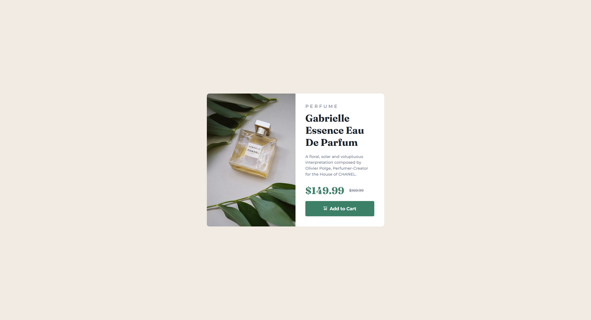
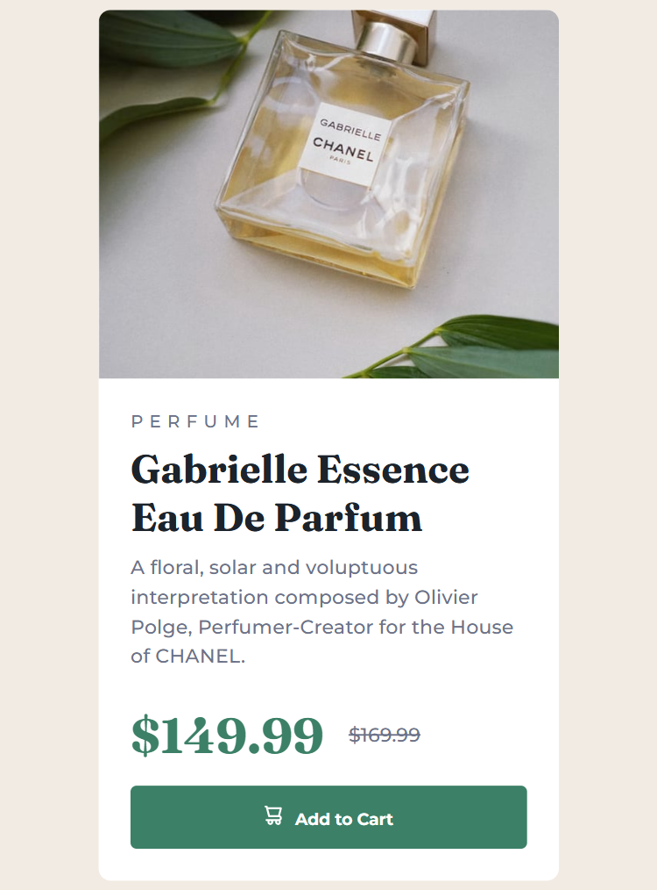

# Frontend Mentor - Product preview card component solution

This is a solution to the [Product preview card component challenge on Frontend Mentor](https://www.frontendmentor.io/challenges/product-preview-card-component-GO7UmttRfa). Frontend Mentor challenges help you improve your coding skills by building realistic projects.

## Table of contents

- [Overview](#overview)
  - [The challenge](#the-challenge)
  - [Screenshot](#screenshot)
  - [Links](#links)
- [My process](#my-process)
  - [Built with](#built-with)
  - [What I learned](#what-i-learned)
  - [Continued development](#continued-development)
  - [Useful resources](#useful-resources)


## Overview

This project is a responsive product preview card component built as part of a Frontend Mentor challenge. The goal was to recreate a visually appealing card that showcases a product, including its image, description, price, and a call-to-action button. The component adapts seamlessly to different screen sizes, ensuring a consistent user experience on both desktop and mobile devices. The implementation emphasizes semantic HTML, modern CSS (including custom properties and Sass), and accessibility best practices.

### The challenge

Users should be able to:

- View the optimal layout depending on their device's screen size
- See hover and focus states for interactive elements

### Screenshot




### Links

- Solution URL: [https://github.com/remainhumble/Product-preview-card-component]
- Live Site URL: [Add live site URL here](https://your-live-site-url.com)

## My process

### Built with

- Semantic HTML5 markup
- CSS custom properties
- Flexbox
- Mobile-first workflow
- Sass

### What I learned

During this project, I learned how to structure a responsive product preview card component using semantic HTML and modern CSS techniques like custom properties and Sass. I also practiced implementing a mobile-first workflow and ensuring accessibility by adding proper focus and hover states to interactive elements. This challenge helped reinforce my understanding of component-based design and responsive layouts.

To see how you can add code snippets, see below:

```css
$textTransform: uppercase;
$Green: hsl(158, 36%, 37%);
$GreenHover: hsl(158, 42%, 18%);
$White: hsl(0, 0%, 100%);
$Black: hsl(212, 21%, 14%);
$Grey: hsl(228, 12%, 48%);
$Cream: hsl(30, 38%, 92%);
$paragraphSize: 1rem;
$Fraunces: "Fraunces", sans-serif;
$Montserrat: "Montserrat", sans-serif;
```

### Continued development

In future projects, I want to continue focusing on:

- Improving my understanding of advanced CSS layout techniques, such as CSS Grid and container queries.
- Enhancing accessibility by learning more about ARIA roles and semantic HTML.
- Refining my use of Sass for better organization and maintainability of stylesheets.
- Practicing component-based design patterns to create more reusable and scalable UI elements.
- Deepening my knowledge of responsive design, especially for complex layouts and edge cases.
- Exploring performance optimization strategies for faster load times and better user experience.
- Experimenting with CSS animations and transitions to add subtle, engaging interactions.
- Strengthening my workflow with modern build tools and version control best practices.

### Useful resources

- [Sass Documentation](https://sass-lang.com/documentation/) - The official Sass documentation is an excellent resource for learning about Sass features, syntax, and best practices.
- [GeeksforGeeks](https://www.geeksforgeeks.org/what-is-a-css-preprocessors/) - An article to know all about CSS preprocessors we can use to apply css in another level, especially when stylesheets gradually increase in size.
- [CSS-Tricks](https://css-tricks.com/) - A comprehensive site with articles, guides, and tips on all things CSS, including layout techniques, animations, and best practices.

## Author

- Frontend Mentor - [@remainhumble](https://www.frontendmentor.io/profile/remainhumble)
- X(formerly Twitter) - [@thiflan120699](https://x.com/thiflan120699)
